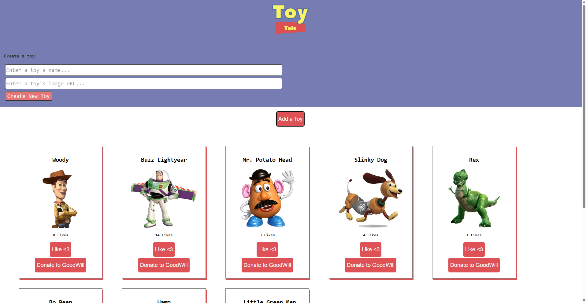

# Toy Tales

A React application that allows users to view, create, delete, and like toys. This project uses a mock REST API powered by `json-server` to demonstrate CRUD operations, state management, controlled forms, and component communication in React.

## Features

- Fetches toy data from a REST API when the application loads
- Displays toys as individual cards with images and like counts
- Creates new toys using a controlled form
- Deletes toys from the collection
- Updates toy likes using PATCH requests
- Persists all changes through a `json-server` backend

## Screenshot



## Technologies Used

- React
- JavaScript (ES6+)
- Fetch API
- JSON Server
- HTML5
- CSS3

## Project Structure

```text
src/
├── App.jsx
├── Header.jsx
├── ToyContainer.jsx
├── ToyCard.jsx
└── ToyForm.jsx
```

## Installation

1. Clone the repository.

```bash
git clone <repository-url>
cd toy-tales
```

2. Install dependencies.

```bash
npm install
```

3. Start the mock API server.

```bash
npm run server
```

4. In a separate terminal, start the React application.

```bash
npm run dev
```

5. Open the application in your browser.

```text
http://localhost:3000
```

## API Endpoints

| Method | Endpoint | Description |
|----------|----------|-------------|
| GET | `/toys` | Retrieve all toys |
| POST | `/toys` | Create a new toy |
| PATCH | `/toys/:id` | Update a toy's likes |
| DELETE | `/toys/:id` | Delete a toy |

## Learning Objectives

This project demonstrates:

- Managing state with React Hooks
- Fetching data with `useEffect`
- Creating controlled forms
- Passing data through props
- Inverse data flow between child and parent components
- Updating collections using `map()`
- Removing items using `filter()`
- Performing CRUD operations against a REST API

## Future Improvements

- Add form validation
- Display loading and error states
- Add search and filtering functionality
- Improve styling and responsiveness
- Add confirmation before deleting toys

## Author

Matthew Swanberg

## License

Created by Matthew Swanberg as part of a Full CRUD Functionality in React lab assignment (Course 5, Module 3).